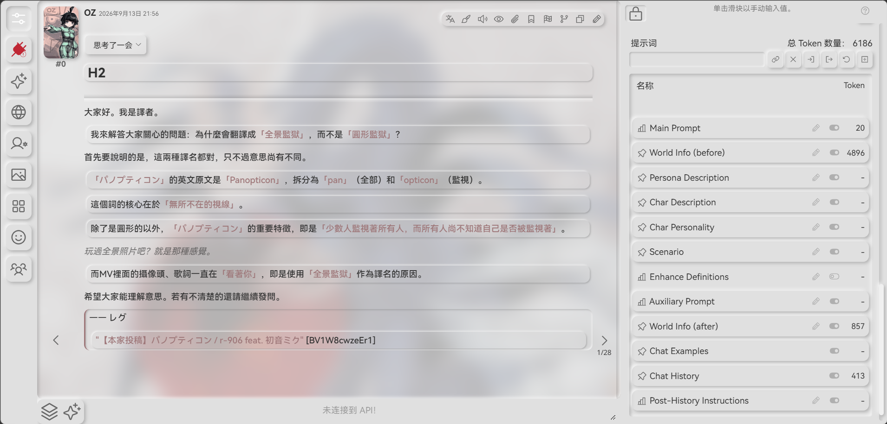
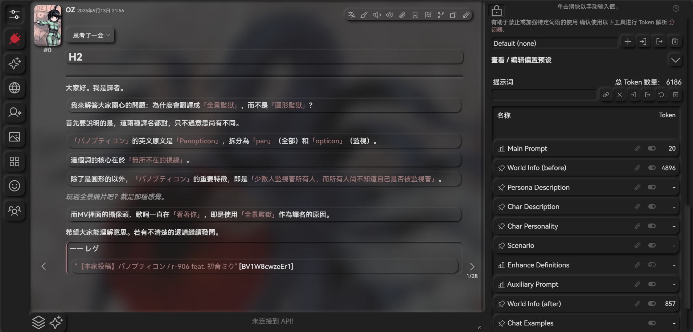
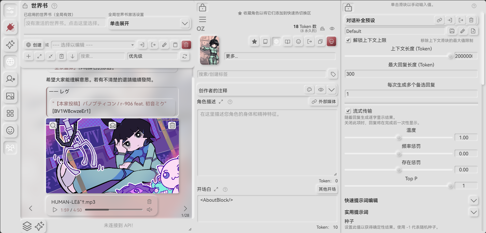
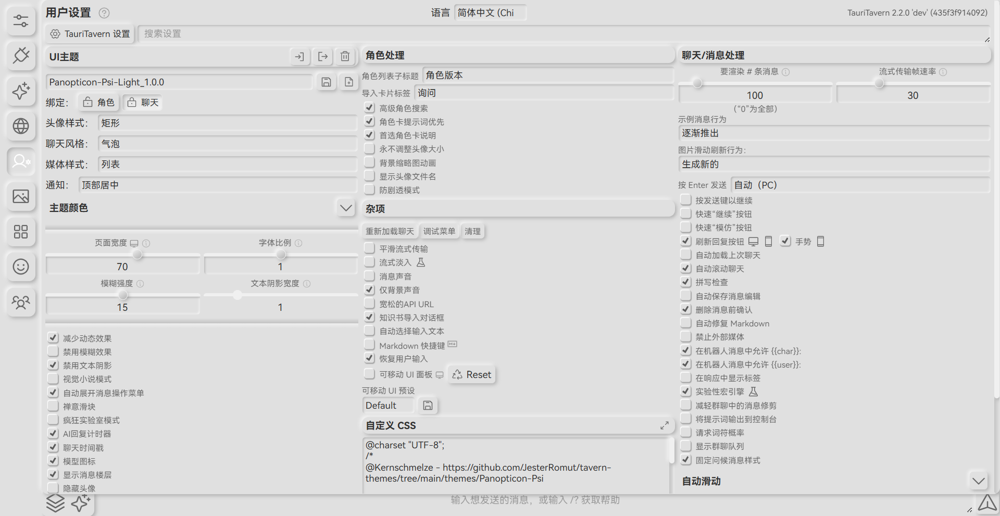
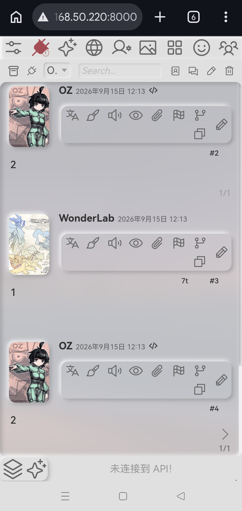

# Panopticon-Psi

只是一个新拟物主题

感谢`https://neumorphism.io/`

感谢[Gruvbox](https://github.com/KronosXup/sillytavern-gruvbox-harmony)的图标大改







## PendingUpdate

```markdown
## 1.0.5

- 修复了与消息内状态栏一同使用时会遮挡右侧swipe的问题
- 修复了PC端预设tab和角色tab左边出现白色亮部，看起来没有一体化的问题
- 修复了小白X消息按钮展开时布局异常的问题
```
